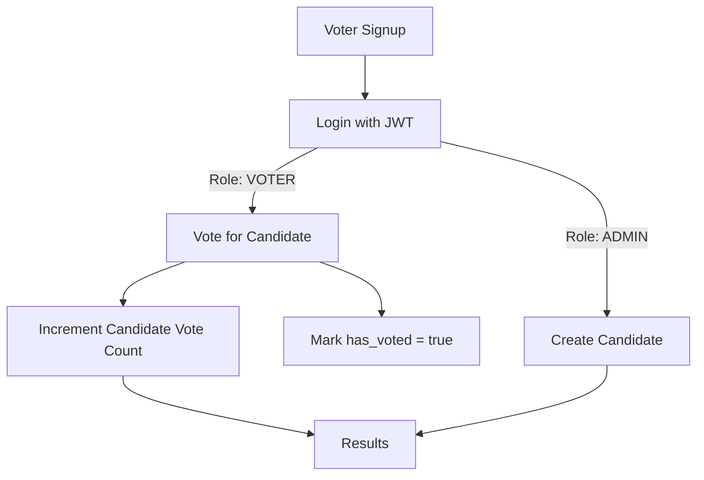

# 🗳️ Online Voting System (Spring Boot + MySQL)

An **industry-level Online Voting System** built with **Java, Spring Boot, MySQL, JWT, and Spring Security**.
Designed for **secure, transparent, and one-time voting** with **role-based access** for Voters, Admins, and Candidates.

---

## ⚡ Tech Stack

* **Backend:** Java 17+, Spring Boot
* **Database:** MySQL (InnoDB)
* **ORM:** Spring Data JPA (Hibernate)
* **Security:** Spring Security + JWT + BCrypt
* **Build Tool:** Maven

---

## 📂 Project Structure

```
online-voting-system/
│── src/main/java/com/codex/voting/
│   ├── config/          # Security + JWT config
│   ├── controller/      # REST APIs
│   ├── dto/             # Request/Response models
│   ├── entity/          # Entities (Voter, Candidate, Admin, Election)
│   ├── repository/      # JPA Repositories
│   ├── security/        # JWT filters + Auth classes
│   ├── service/         # Business logic
│   └── OnlineVotingSystemApplication.java
│
│── src/main/resources/
│   ├── application.yml  # MySQL + JWT configs
│   └── schema.sql       # DB initialization (optional)
│
└── pom.xml              # Dependencies
```

---

## 📊 Database Design

### `voters`

\| id | voter\_id | name | email | password | dob | legal\_document | has\_voted |

### `candidates`

\| id | mark\_name (unique) | description | vote\_count |

### `admins`

\| id | email | password | created\_at |

### `elections`

\| id | title | start\_time | end\_time | is\_active |

---

## 🔑 Corrected Rules

* **Signup** → Only VOTERS can self-register.
* **Admin** → Only Admin can create new Candidates.
* **Candidates** → Not derived from voters; created separately with unique identity (`markName` / symbol).
* **Voting** → A voter can select **exactly one** candidate.
* **Result** → Shows **total votes per candidate**.

---

## 🔁 Flow Chart




## 🚀 Running the Project

1. **Clone Repo**

   ```sh
   git clone https://github.com/yourusername/online-voting-system.git
   cd online-voting-system
   ```

2. **Configure MySQL in `application.yml`**

   ```yaml
   spring:
     datasource:
       url: jdbc:mysql://localhost:3306/votingdb
       username: root
       password: yourpassword
     jpa:
       hibernate:
         ddl-auto: update
       show-sql: true
   jwt:
     secret: your_jwt_secret
     expiration: 3600000
   ```

3. **Run App**

   ```sh
   mvn spring-boot:run
   ```

4. **Access APIs** → `http://localhost:8080/api/...`

